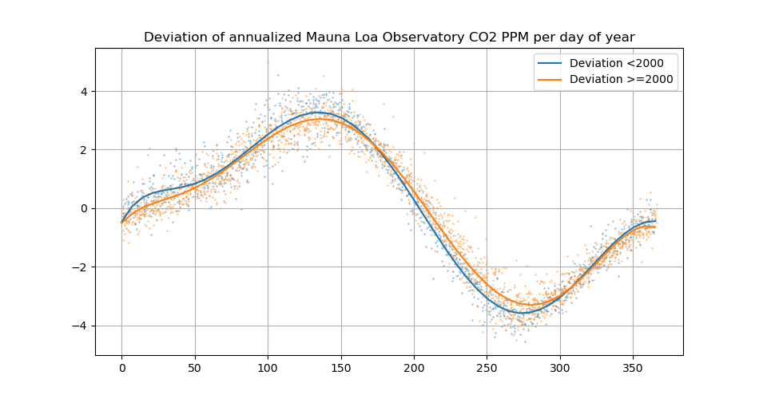
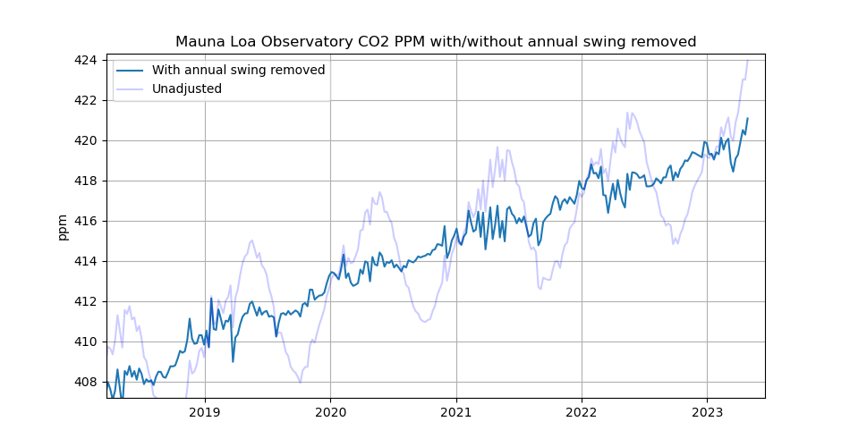
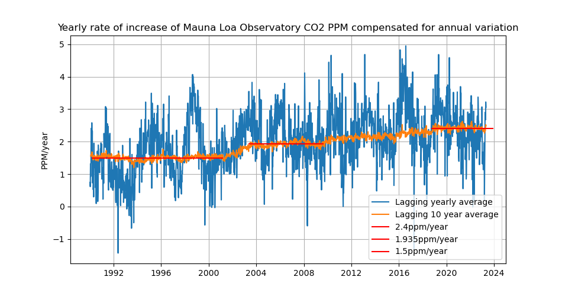

# co2plots
Here I'll be gathering some CO2 plotting scripts.

Data from: "C.  D.  Keeling, S.  C.  Piper, R.  B.  Bacastow, M.  Wahlen, T. 
P.  Whorf, M.  Heimann, and H.  A.  Meijer, Exchanges of atmospheric CO2 and
13CO2 with the terrestrial biosphere and oceans from 1978 to 2000.  I. 
Global aspects, SIO Reference Series, No.  01-06, Scripps Institution of
Oceanography, San Diego, 88 pages, 2001."

